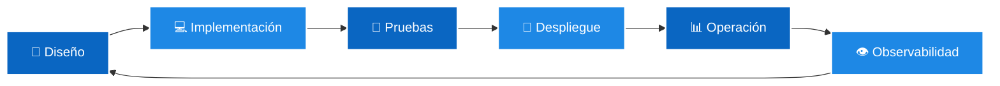

<!-- Professional Banner with gradient background -->

 

<!-- Animated Typing Effect -->

  

<strong>Hola, Soy Juan Antonio Mora.</strong> Gracias por visitar mi espacio en GitHub 🤓

<!-- Visitor Counter and Social Badges -->

---

## 🔍 **Sobre mí**

Con más de **25 años de experiencia en la gestión de proyectos tecnológicos de alta complejidad**, he construido una trayectoria sólida en **DevOps**, **Cloud**, **automatización** y **metodologías ágiles**.

En los últimos años he puesto un foco especial en la **Inteligencia Artificial Generativa (GenAI)**, explorando cómo los **LLMs (Large Language Models)** y sus diferentes plataformas —**Google AI**, **GitHub Copilot**, **OpenAI**, entre otras— pueden integrarse en todo el ciclo de vida de las aplicaciones: desde la concepción y diseño, pasando por el desarrollo, pruebas y despliegue, hasta la operación y la observabilidad. Dedico parte de mi tiempo a experimentar y desarrollar **soluciones prácticas** que ayudan a equipos y organizaciones a incrementar la productividad, acelerar la entrega de valor y simplificar la adopción de tecnologías complejas.

 

Cuento con un amplio dominio de las principales plataformas del ecosistema empresarial y de código abierto: **Jenkins**, **GitHub Actions**, **CloudBees CD**, **GitLab CI/CD**, **ArgoCD**, **Backstage**, **Terraform**, **Ansible**, **Harness**, **Tanzu**, **XebiaLabs**, **Docker**, **Kubernetes**, **OpenShift**, así como herramientas de calidad, observabilidad y testing como **Maven**, **Selenium Grid**, **Playwright**, **SonarQube**, **JMeter**, **ElasticSearch**, **Grafana**, **Kibana**, **Nexus**, **TestLink**, entre muchas otras.

Como **Scrum Master** y **líder de proyectos**, promuevo la colaboración, la innovación y la mejora continua, asegurando que los equipos puedan entregar soluciones de forma ágil, segura y alineada con los objetivos estratégicos del negocio.

Mi visión está orientada a aplicar las últimas tendencias tecnológicas —especialmente **GenAI**, **Cloud** y **DevOps**— para generar impacto real en la eficiencia, calidad y velocidad de entrega de las organizaciones.

 

### 🎯 **Fuera del ámbito profesional**

Encuentro inspiración en deportes como el **montañismo**, el **esquí**, el **mountain bike** y el **running**, que reflejan mi **resiliencia**, **disciplina** y **espíritu competitivo**, valores que también guían mi carrera profesional.

---

## 🧠 **Áreas de especialización**

 

### 🚀 DevOps, Cloud & Platform Engineering

### 🔧 Calidad, Observabilidad & Testing

---

## 🧬 **Mi rol en IA**

### 🤖✨ Inteligencia Artificial Generativa

 

Uso avanzado de **LLMs** en todas las fases del ciclo de vida del software:  
**diseño, desarrollo, pruebas, documentación, seguridad, operación y CI/CD**.

Trabajo con múltiples modelos y plataformas para crear **soluciones reales**, integradas con entornos DevOps modernos.

  
  
  
  
  
  

 

### ⚡ **Qué aporto en IA**

<table align="center">
<tr>
<td width="50%">

- 🤖 Creación y orquestación de **agentes autónomos** aplicados a DevOps
- ☁️ Integración de IA en plataformas cloud y pipelines reales
- 📝 Diseño de **prompts avanzados** y patrones de prompting

</td>
<td width="50%">

- 📄 Generación automática de documentación, QA y tests
- 🔍 Análisis de código con IA
- 📊 Evaluación continua y métricas de rendimiento de modelos

</td>
</tr>
</table>

 

> **💡 La IA no sustituye a los desarrolladores: los amplifica.**  
> **🚀 Mi objetivo es transformar cada equipo en un equipo aumentado.**

---

## 🧩 **Mi filosofía de trabajo**

 

> *"La tecnología es un habilitador, pero son las personas quienes la convierten en impacto real."*

 

Como **Scrum Master y líder técnico**, impulso la:

| 🤝 Colaboración | 📈 Mejora Continua | 🚀 Entrega Ágil | 🎯 Alineación con Negocio |
|:--------------:|:------------------:|:---------------:|:-------------------------:|
| Equipos unidos | Aprendizaje constante | Deployments seguros | Valor real |

  

---

## 📂 **Proyectos y contribuciones**

 

| 🚀 Tipo | 🔗 Enlace | 📝 Descripción |
|-------|---------|------------------|
| 📦 **Repositorio GitHub** |  | Demos, herramientas, integraciones y automatizaciones |
| 🤖 **Experimentos GenAI** |  | Pruebas avanzadas con LLMs y agentes | 
| ☁️ **Infraestructura & CI/CD** |  | Pipelines, Kubernetes, Infra as Code |

---

## 📊 **Actividad en GitHub**

 

<!-- GitHub Stats Cards -->

  

<!-- Activity Graph -->

---

## ✉️ **Contacto**

 

¿Quieres conectar, colaborar o simplemente hablar de tecnología?

 

  

  

---

**⭐ Si te gusta mi trabajo, no dudes en dejar una estrella en mis repositorios ⭐**

 

**Hecho con ❤️ y mucho ☕**

